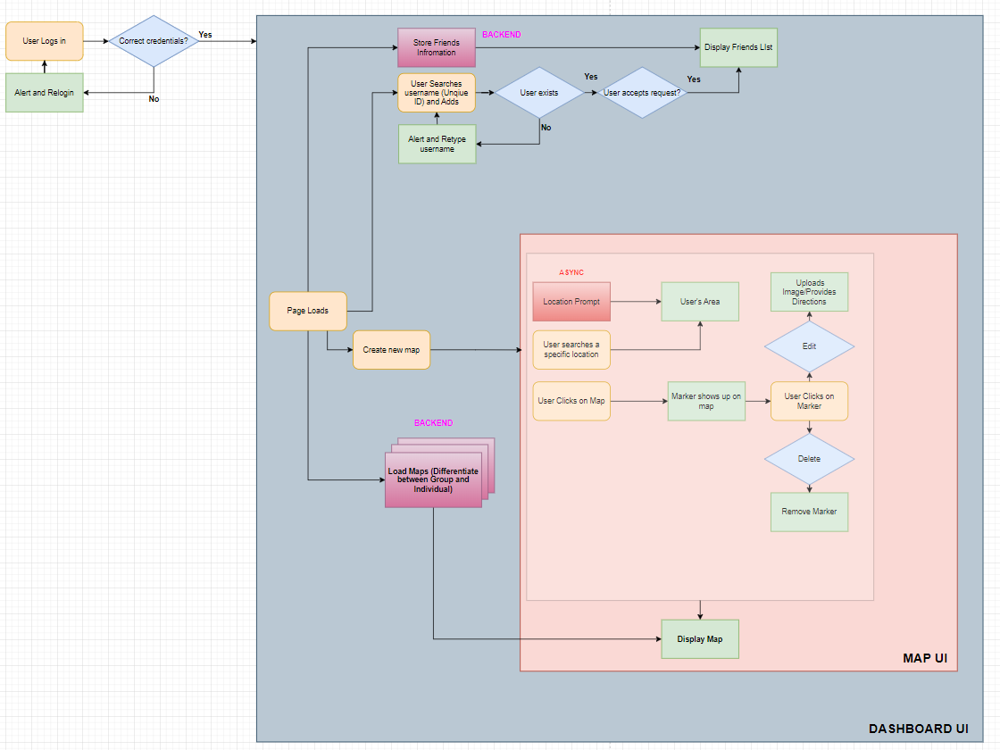

# LowkeySpots

## 👋 Introduction
  [**_LowkeySpots_**](www.lowkeyspots.com) is a social app that enables users to share customized spots with each other on personal, interactive maps. 

  

  The **Goal** of this project was to offer a distraction-free platform tailored for efficiency and simplicity. Its clean interface and intuitive design make it effortless for users to navigate and share their adventures, whether they're tech-savvy or new to the platform. Ideal for friends and family, LowkeySpots provides a personalized space to curate and share memories, adding an exclusive touch to social sharing experiences.

## ⚙️ Tech Stack
LowkeySpots is a **full-stack** application built using the following technologies:

    
       
    
    
    
   
   
    

Additionally, [**MapBox**](https://www.mapbox.com/) was used for rendering maps and retrieving geological data 

## 🧰 Features

### Adding Friends

You can see all your requests in the **Pending** tab. Here you can choose to accept or deny friend requests

If accepted, you will be able to see each other as a friend on the **Friends** tab:

When sending friend requests go to the **Add Friend** Tab:

Type in the your friend's username and click Send Request:

If the username exists you will get this message:

**Error Handling:**

_Username does not exist_

_Already Friends_

_Request already sent_

### Map Dashboard

This is your map dashboard. Here you will be able to see all the maps you have created

In LowkeySpots, there are three different roles : **Admin**, **Collaborator**, and **Spectator**. These roles will be explained in further detail but for know all you need to know is that if you are an Admin then you can delete maps, which essentially removes all users who were part of the map. However, if you are a Collaborator or Spectator, you will have the option to leave the map. At the top you can see there is a filteration system for these roles 

To create a new map simply press the New Map button. You will then be prompted this window

Once created, your map will be in your dashboard!

### Using and Sharing maps

This is the map editior

On the left is the **Marker Bar**, where you **Edit**, **View Photos**,  or **Delete**. Click on the name itself will fly to the marker

When editing a spot you will be prompted this window. As you can see, you can change **Name, Description, Color,** and **Upload Photos**

You can view the gallery for the spot as well. Each spot can have up to 10 images:

To add people on the map simply press on **Add Friend**. You will be prompted this window where you can add them as a  Collaborator or Spectator

Once you add them you can see them by pressing the **Member List** button. If needed, you can either remove or change the permissions of these members

 - A Collobarator is someone who can do everything an Admin can except for adding/removing members
 - A Spectator is someone who can only view the map along with markers and photos

An example where Spectators might be needed or helpful is for marathons which have very specific routes that can be displayed using markers. Obviously we would not want runners to change /edit the markers so we can add them as Spectators. 

## 🎨 Design 

The website has 3 pages: Homepage, Friend Page and Map Page

We also created a RESTful API by using Entity-Relatioship Database Design Concepts and created the following schema which includes the **User, Friend, Map,** and **Marker** base 

**USER**

| Field           | Type            | Description                                                   |
|-----------------|-----------------|---------------------------------------------------------------|
| `name`            | `string`          | *might need to hash User.name and request_id*                |
| `psswd`           | `string`          |                                                               |
| `email`           | `string`          |                                                               |
| `date_created`    | `DateTime object` |                                                               |
| `account_deleted` | `bool`            |                                                               |
| `map_count`       | `int`             |                                                               |
| `token`           | `hash`            |                                                               |

**FRIEND_REQUEST**

| Field       | Type            | Description                                                                |
|-------------|-----------------|----------------------------------------------------------------------------|
| `request_id`  | `int(chron)`      |                                                                            |
| `sender`      | `USER.name`       |                                                                            |
| `receiver`    | `USER.name`       |                                                                            |
| `status`      | `int`             | *0: pending \| 1: accepted \| 2: rejected \| 3: invalid request*          |

**USERS_RELATION**

| Field    | Type       | Description                                              |
|----------|------------|----------------------------------------------------------|
| `user_1`   | `USER.name`  |                                                          |
| `user_2`   | `USER.name`  |                                                          |
| `status`   | `int`        | *0: nothing \| 1: friend \| 2: blocked*                 |

**MAP**

| Field           | Type        | Description                                                                   |
|-----------------|-------------|-------------------------------------------------------------------------------|
| `map_id`          | `int(chron)`  |                                                                               |
| `map_title`       | `string`      | *should be max 200 characters*                                               |
| `map_description` | `string`      |                                                                               |
| `theme`           | `string`      | *integer string depending on the customizations '00' by default can go to something like '66'* |
| `origin_load_x`   | `float: LAT`  |                                                                               |
| `origin_load_y`   | `float: LONG` |                                                                               |
| `marker_count`    | `int`         | *should be limited to 20 markers maybe*                                      |
| `is_deleted`      | `bool`        |                                                                               |

**MAP_USER**

| Field    | Type         | Description                                              |
|----------|--------------|----------------------------------------------------------|
| `map_id`   | `MAP.map_id`   |                                                          |
| `user_id`  | `USER.name`    |                                                          |
| `status`   | `int`          | *0: owner \| 1: collaborator \| 2: spectator*           |

**MARKER**

| Field         | Type          | Description                                              |
|---------------|---------------|----------------------------------------------------------|
| `marker_id`     | `int(chron)`    |                                                          |
| `position_x`    | `float: LAT`    |                                                          |
| `position_y`    | `float: LONG`   |                                                          |
| `translated`    | `string`        | *street address*                                         |
| `map`           | `int: MAP.id`   |                                                          |
| `placer_id`     | `string: USER.name` |                                                      |
| `time_placed`   | `DateTime`      |                                                          |
| `image_count`   | `int`           | *will be capped at 5 images per marker*                 |
| `has_desc`      | `bool`          | *stored as /maps/MAP.map_id/marker_id/image_id*         |
| `is_removed`    | `bool`          |                                                          |

**MAP_REQUEST**

| Field         | Type          | Description                                              |
|---------------|---------------|----------------------------------------------------------|
| `request_id`    | `int(chron)`    |                                                          |
| `sender`        | `USER.name`     |                                                          |
| `receiver`      | `USER.name`     |                                                          |
| `request_type`  | `int`           | *0: collaborator \| 1: spectator*                       |
| `status`        | `int`           | *0: pending \| 1: accepted \| 2: rejected*              |

Using the flowchart and schema ensured SOLID principles and production-ready code 
## 🎥 Website Demos
Here are some demos throughout the process:
https://drive.google.com/drive/folders/1gS8rGF8E800ZelistKDFH2fldJ0onFzv?usp=drive_link

## ❓ Future Features

Some features we wish to implement in the future: 
1. **Profile Management:**
   - Enable users to create and manage their profiles (Location, Interests).
   - Include options for users to add profile pictures and personal information. *
2. **User Interface :**
    - Implement algorithms for directions and routing.
3. **Activity Types:**
   - Define different types of leisure activities (e.g., playing a specific sport, biking, hiking).
   - Let users categorize their shared locations based on activity types. (Leisure, Business) *
4. **Social Features:**
   - Implement a news feed to show updates and activities from following users.
   - Location groups where only users who are in that area can join can be divided into (Province, City, Area) *
   - Chat System *
5. **Notifications:**
   - Send notifications to users for activities such as new location shares, being added to a map, or friend requests.
6. **Rating and Reviews:**
   - Allow users to comment on shared locations.
7. **Reporting and Moderation:**
    - Implement a reporting system for inappropriate content or behaviour.
    - Have a moderation system to review and take action on reported content.* 
